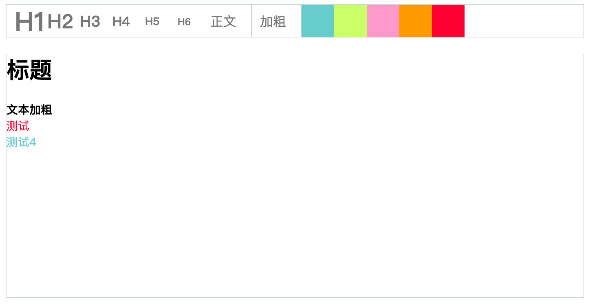

## 一个实验性质的简易文本编辑器


### 如何使用

先生成editor.js文件

```
yarn build
```

引入文件

```
<script defer src="./dist/editor.js"></script>
```

选择一个容器用以初始化编辑器

```
<div id="editor_root"></div>
```

初始化编辑器

```
new Editor('#editor_root', {
  style: {
    height: '300px',
  },
});
```

